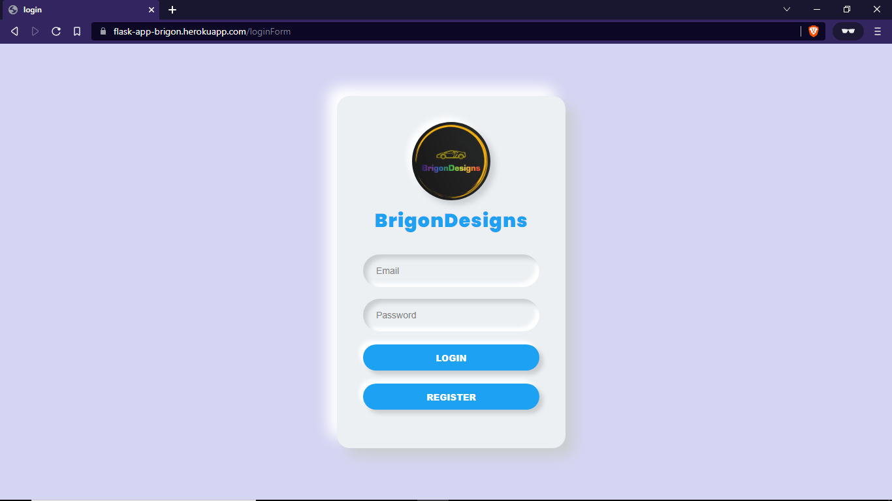
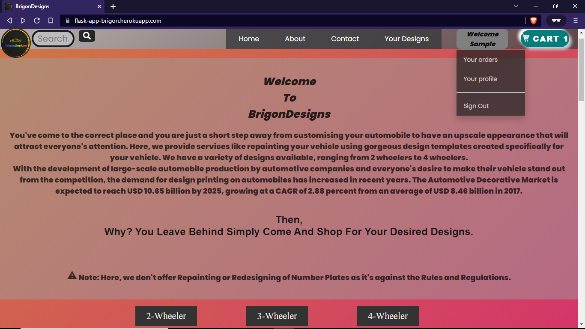
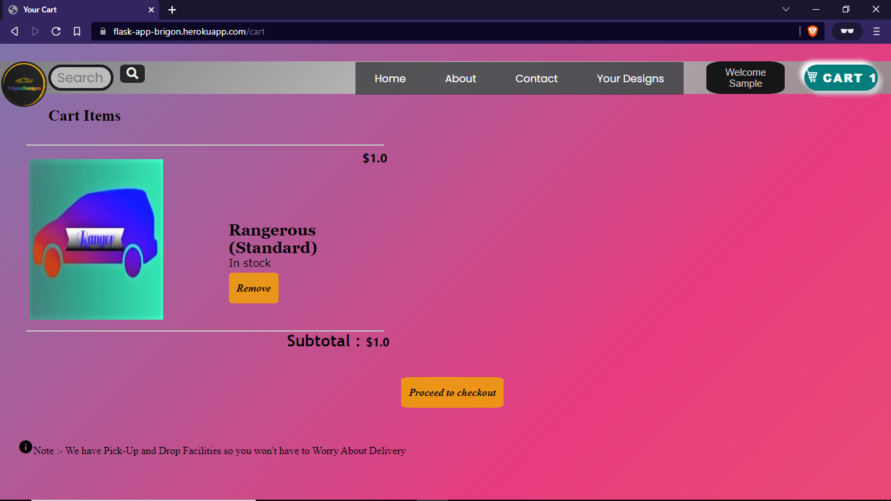
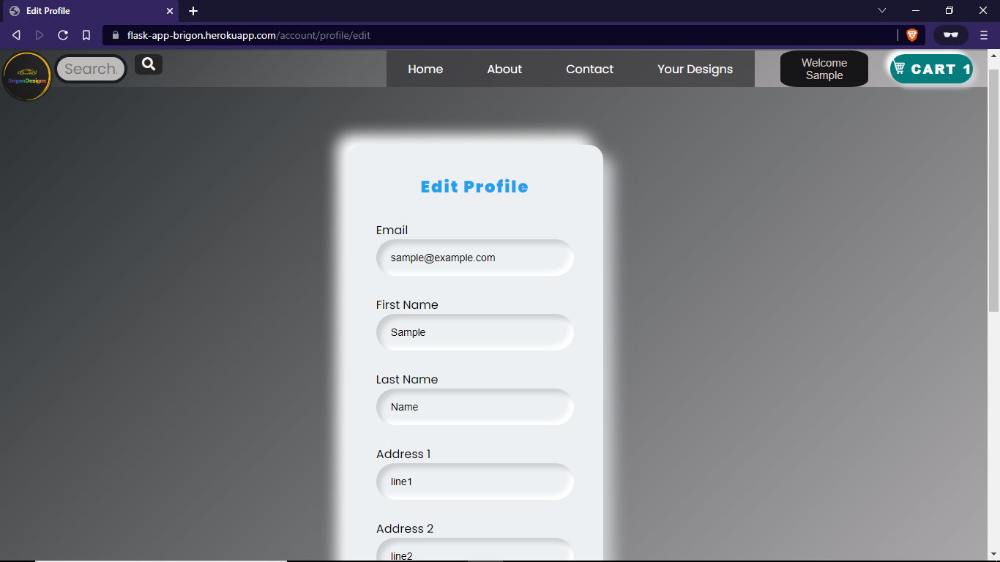
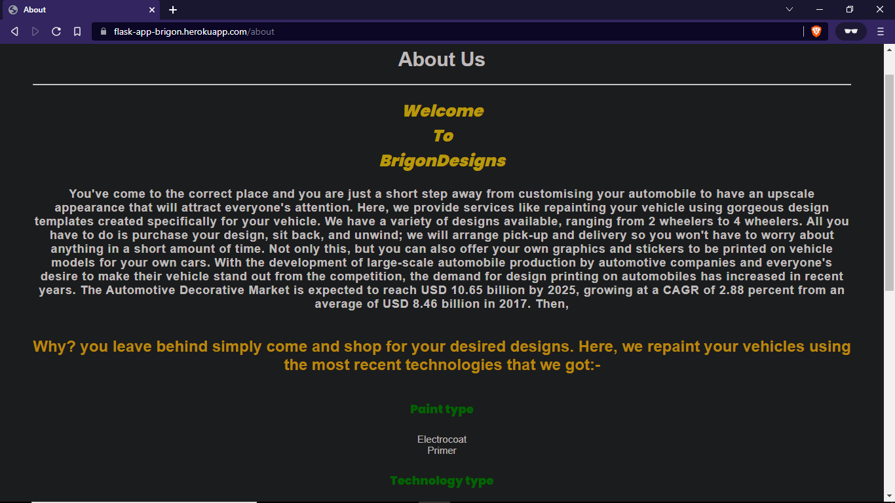

# E-commerce Design Cart  
A straightforward Flask-powered online store where you can shop from available designs for your automobile. Not only this but you can upload your own designs too. Providing feature of Login/Logout,Cart-Page,Contact-Page,About-Section & more such features.

## ScreenShots

 
 
 

## Steps to Run Applications ##
1.Run SiteBackend.py to set up the database Or Use existing database included in the repo.

2.Execute application.py (Try to Run in VirtualEnv for Ease).

3.In the browser, type localhost:5000.

## Requirements ##
1. Sqlite-3
2. Flask-2.0 or Above
3. Python3 or Above

## Site Link
https://brigondesigns.onrender.com

## Sample Login Account ##
Sample credentials present in existing database:
Username - sample@example.com

Password - sample
